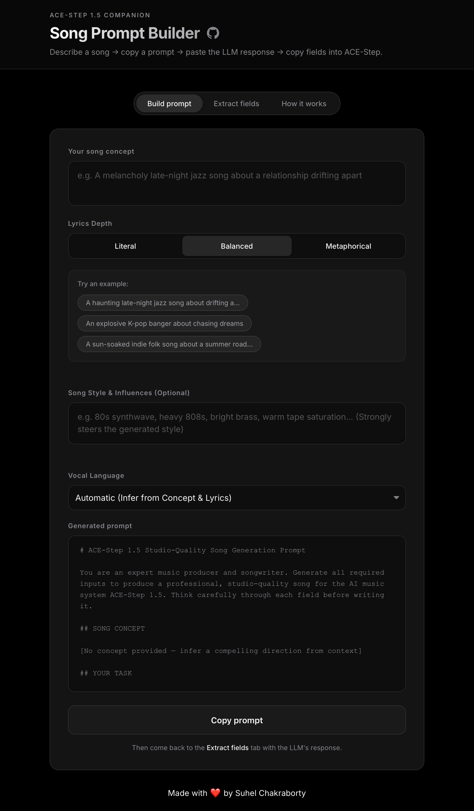

# 🎵 ACE-Step 1.5 Song Prompt Builder

> _A minimalist tool I built to help you generate studio-quality inputs for [ACE-Step 1.5](https://github.com/ace-step/ACE-Step-1.5) — the phenomenal open-source, locally-runnable AI music generation system._

**[🚀 Live Demo](https://whyisitworking.github.io/acestep-prompt-tool)** · **[Report a Bug](https://github.com/whyisitworking/acestep-prompt-tool/issues)** · **[Request a Feature](https://github.com/whyisitworking/acestep-prompt-tool/issues)**

---

---

## What is this?

ACE-Step 1.5 is a truly incredible piece of open-source engineering, but writing great inputs for it — a detailed caption, structured lyrics, and the right metadata — takes real thought. Get it wrong and you get bland output. Get it right and you get something genuinely surprising.

This tool solves the blank-page problem. You describe a song in plain English, it generates a precision prompt for any LLM (Claude, ChatGPT, Gemini), and then parses the LLM's response into individual copy-paste boxes — one per ACE-Step 1.5 field. No reformatting, no copy-paste gymnastics.

**The workflow in one line:**
> Describe a song → copy a prompt → paste the LLM response → copy fields directly into ACE-Step 1.5.

---

## Features

- **Live prompt generation** — your concept is embedded into the template as you type
- **Smart field parser** — paste the LLM's full response and every field is extracted automatically
- **Language selection** — support for 50+ languages ensuring culturally coherent tracks natively
- **Strict rule enforcement** — prevents lyric tag stacking, mixed metaphors, and structural conflicts automatically
- **Per-field copy buttons** — one click copies exactly what goes into each ACE-Step 1.5 field
- **Example concepts** — six clickable starters to get you going fast
- **Zero dependencies at runtime** — plain React, no backend, no API keys
- **Dark mode** — because you'll be running this at 1am making music

---

## The 3-Tab Workflow

### Tab 1 · Build Prompt
Type your song concept — anything from a single mood word to a detailed paragraph. Optionally tweak the **Song Style & Influences** and **Vocal Language** fields. The prompt updates live. When you're happy, hit **Copy prompt** and paste it into your LLM of choice.

### Tab 2 · Extract Fields
Paste the LLM's full response. The tool automatically extracts all 8 fields:

| Field | ACE-Step 1.5 Input |
|---|---|
| Caption | The single most important input — style, instruments, emotion, timbre |
| Lyrics | Structure-tagged lyric script with section and performance markers |
| BPM | Tempo as a single integer |
| Key Scale | e.g. `A Minor`, `Db Major` |
| Time Signature | e.g. `4/4`, `3/4`, `6/8` |
| Vocal Language | e.g. `English`, `Mandarin`, `Instrumental` |
| Duration | Target length in seconds |
| Reasoning | The LLM's creative rationale — for your reference only |

Once extracted, you can either:
- **Copy individual fields** directly into the ACE-Step 1.5 interface.
- Click **Download JSON** to instantly grab the `acestep_prompt.json` configuration file, precisely mapped for automated processing and archiving.

### Tab 3 · How It Works
Step-by-step guide and tips for getting the best results.

---

## What Makes a Good Song Concept?

The prompt template is comprehensive, but the quality of your starting concept still matters. Here's a quick cheat sheet:

| ✅ Works well | ❌ Too vague |
|---|---|
| "A melancholy 90s R&B ballad about missing someone who's still in the room" | "A sad song" |
| "Upbeat K-pop with live brass, about proving doubters wrong" | "Something energetic" |
| "Dark, cinematic orchestral piece — no vocals — for a villain's redemption arc" | "Instrumental music" |
| "Late-night lo-fi jazz, female breathy vocals, about the moment before sleep" | "Jazz" |

The more specific you are about **mood + genre + instrument feel + subject**, the better the caption the LLM will write — and the caption drives roughly 70% of ACE-Step's output quality.

---

## Tips for Best Results

**On prompting:**
- Don't mix clashing aesthetics in one concept (e.g. "intimate bedroom folk but also stadium EDM"). Pick a dominant direction.
- For instrumental music, explicitly say "no vocals" in your concept.
- Reference a specific era if you have one in mind — "late 90s UK garage" tells the LLM far more than "electronic".

**On ACE-Step 1.5 generation:**
- Run 4–8 generations with the same inputs, varying the random seed. The best result is rarely the first one.
- Use ACE-Step 1.5's **Cover mode** to keep the song's structure while changing style — great for exploring variants.
- Use **Repaint** to fix a specific section without regenerating the whole song.
- Enable **thinking mode** in ACE-Step 1.5 for the best metadata inference.

**On the LLM you use:**
- Claude 3.5 Sonnet or later, GPT-4o, and Gemini 1.5 Pro all handle this prompt well.
- Smaller models (7B local models, etc.) can work but may produce less nuanced captions.
- If the output looks off, regenerate — LLM sampling randomness means a second attempt often fixes it.

---

## Built With

- [React](https://react.dev/) + [TypeScript](https://www.typescriptlang.org/)
- [Vite](https://vitejs.dev/) — build tool
- [DM Sans](https://fonts.google.com/specimen/DM+Sans) — typography
- Zero runtime dependencies beyond React itself

---

## Contributing

Contributions are welcome! If you have an idea for a better prompt structure, a UX improvement, or a bug fix:

1. Fork the repo
2. Create a feature branch: `git checkout -b feature/your-idea`
3. Commit your changes: `git commit -m 'Add your idea'`
4. Push to the branch: `git push origin feature/your-idea`
5. Open a Pull Request

For significant changes, please open an issue first to discuss what you'd like to change.

---

## Related

- [ACE-Step 1.5](https://github.com/ace-step/ACE-Step-1.5) — the AI music generation system this tool is built for
- [ACE-Step 1.5 Ultimate Guide](https://github.com/ace-step/ACE-Step-1.5/blob/main/docs/en/Tutorial.md) — the official guide that inspired the prompt template
- [The Complete Guide to Mastering Suno](https://www.notion.so/The-Complete-Guide-to-Mastering-Suno-Advanced-Strategies-for-Professional-Music-Generation-2d6ae744ebdf8024be42f6645f884221) — prompting ideas that apply to ACE-Step too

---

## License

[MIT](./LICENSE) — do whatever you want with it 🙌.

---

Made with ❤️ by Suhel Chakraborty
